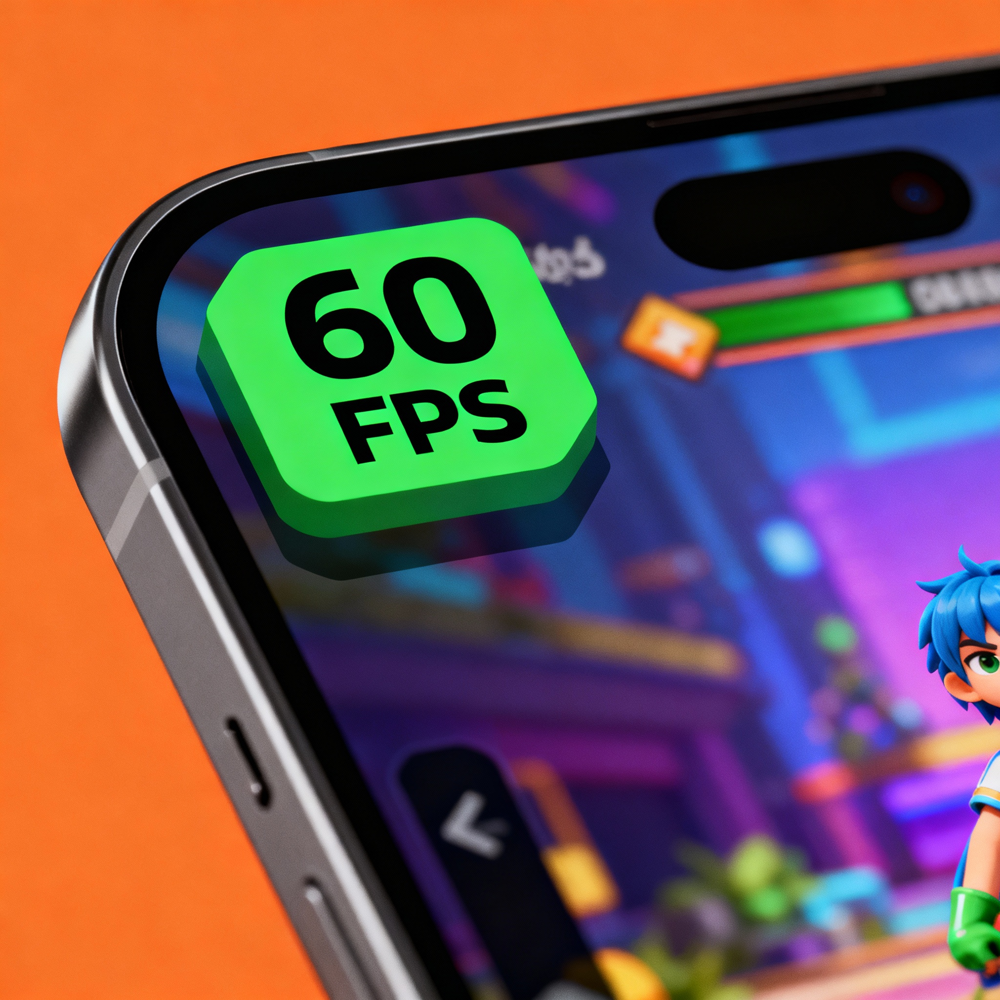
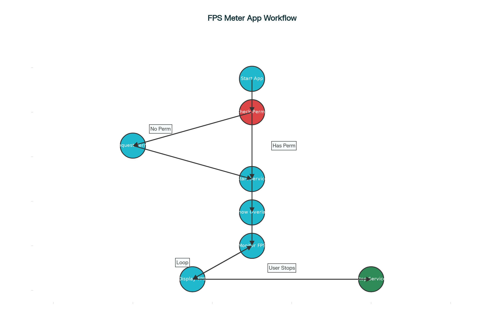

# Android FPS Meter

Android FPS Meter overlays the real-time frame rate (FPS) on any Android application, including games like BGMI and PUBG. It’s open source, requires no root, and works on Android 5.0+.

---

## Features

- Real-time FPS overlay (system and gaming apps)
- Works without root
- Color-coded: **Green** (≥55 FPS), **Yellow** (30–54 FPS), **Red** (<30 FPS)
- Minimal battery/CPU impact
- Easy permissions flow
- Open source (MIT License)

---

## Quick Links

- [Installation Guide (PDF)](docs/Installation-Guide.pdf)
- [API Documentation](API_DOCUMENTATION.md)
- [Troubleshooting](TROUBLESHOOTING.md)
- [Developer Guide](DEVELOPMENT.md)

---

## Visuals & Architecture

---

## Documentation Site

Check the [lightweight documentation site](docs-site/) for a guided tour of features, API, and troubleshooting.

---

## How to Build

Instructions are in [INSTALLATION.md](INSTALLATION.md) and [DEVELOPMENT.md](DEVELOPMENT.md). For a step-by-step, use the installation PDF above.

---

## License

[MIT](LICENSE)
